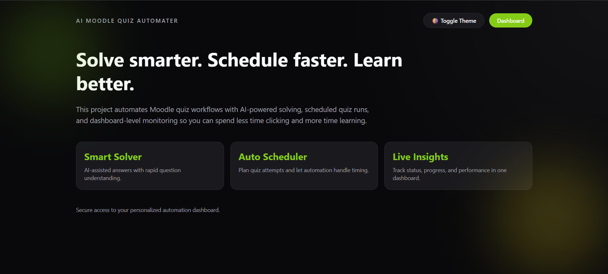
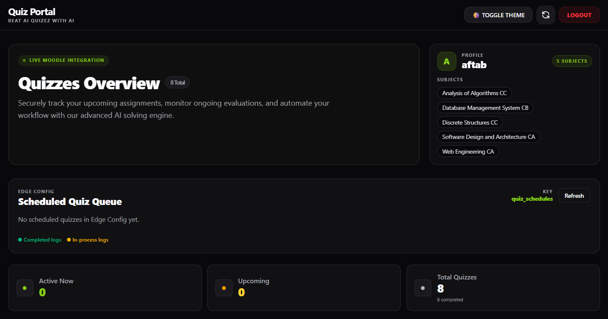
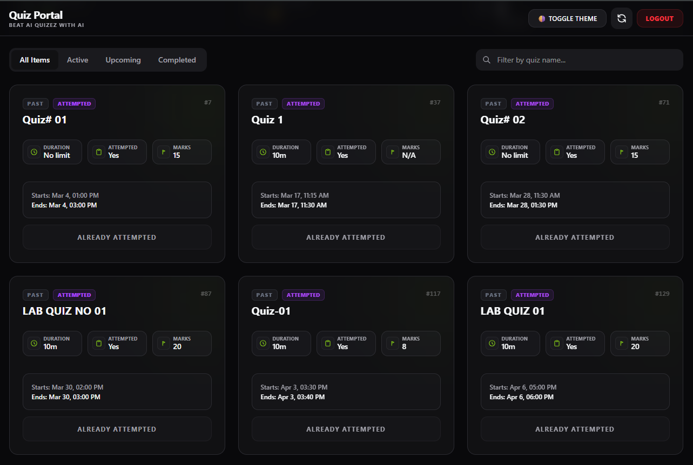

# 🎓 Next.js Moodle AI Auto-Solver

A premium, automated solution for solving Moodle quizzes using Google Gemini 2.0 Flash AI. This tool features a Node.js backend scheduler for real-time auto-solving, a sleek modern dashboard, and secure JWT authentication.

---

## 🖼️ Screenshots

### 1. HOME PAGE

### 2. Dashboard

### 3. Quiz View



## 🔥 Key Features

- **🤖 AI-Powered Solving:** Uses Gemini 2.0 Flash (Function Calling) for 10/10 accuracy scores.
- **🕒 Backend Scheduler:** Set and forget. Quizzes are solved automatically the moment they open.
- **🗂️ Edge Config Queue:** All quiz schedules are stored in one Edge Config key (`quiz_schedules`) and completed entries are removed automatically.
- **📊 Real-time Grouped Logs:** Detailed question-by-question lifecycle logs showing AI reasoning and Choice IDs.
- **📜 Solve History:** Persistent local storage for 7 days with detailed result review and manual deletion.
- **🔐 Secure Access:** JWT-protected dashboard with `.env` based credentials.
- **🎨 Dark Premium UI:** Beautifully crafted dashboard with live status tracking.

---

## 🛠️ Getting Started

### 1. Prerequisites
- [Node.js](https://nodejs.org/) (v18.0.0 or higher)
- [Google AI Studio API Key](https://aistudio.google.com/)
- Moodle WebService Token (enabled for `mod_quiz` functions)

### 2. Installation
1. Clone your project:
   ```bash
   git clone aftabalikhandeveloper/nextjs-moodle
   cd nextjs-moodle
   ```
2. Install dependencies:
   ```bash
   npm install
   ```

### 3. Configuration (`.env`)
Create a `.env` file in the root directory and add the following:
```env
# Moodle
MOODLE_URL="https://your-moodle.com"
MOODLE_TOKEN="your_moodle_token"

# Google Gemini
GEMINI_API_KEY="your_api_key_here"

# Vercel Edge Config (required for serverless quiz scheduling)
# Read connection string for @vercel/edge-config SDK
EDGE_CONFIG="your_edge_config_connection_string"

# Write access for updating quiz schedules/statuses
VERCEL_API_TOKEN="your_vercel_api_token"
EDGE_CONFIG_ID="your-edge-id-here"

# Optional (recommended) secret for /api/cron/auto-solve
CRON_SECRET="your_cron_secret"

# Auth Settings
ADMIN_USERNAME="admin"
ADMIN_PASSWORD="your_secure_password"
JWT_SECRET="a_random_32_character_string"
```

### 4. Running Locally
```bash
npm run dev
```
Visit `http://localhost:3000` and sign in.

### 3.1 Getting your Moodle token

You can obtain a Moodle webservice token by requesting the `login/token.php` endpoint on your Moodle site. Use the `moodle_mobile_app` service (or the service name configured on your Moodle instance).

Example URL (replace placeholders with your values):

```
http://YOUR_MOODLE_DOMAIN/login/token.php?username=YOUR_USERNAME&password=YOUR_PASSWORD&service=moodle_mobile_app
```

Notes:
- Replace `YOUR_MOODLE_DOMAIN`, `YOUR_USERNAME`, and `YOUR_PASSWORD` with your Moodle site and account details.
- Do NOT share your password or token publicly. Treat the token like a password and keep it in your `.env` file as `MOODLE_TOKEN`.
- If your Moodle uses HTTPS, be sure to use `https://` in the URL.


---

## 🚀 Deployment to Vercel

1. **Connect Repository:** Link your private GitHub/GitLab repo to Vercel.
2. **Environment Variables:** In Vercel Project Settings, add all `.env` variables listed above.
3. **Deploy:** Click deploy.

4. **Cron Job (cron-job.org):**
   - URL: `https://your-domain.com/api/cron/auto-solve?secret=YOUR_CRON_SECRET`
   - Method: `GET`
   - Interval: every 1 minute

> **💡 Note for Experts:**
> Vercel has serverless function timeouts. For background scheduled tasks, this project is optimized for shorter gaps. For full-day background timers, consider a long-running Node server (DigitalOcean/Railway).

---

## 📖 How to Use (Normal User)

1. **Connect to Moodle:** Once configured, your dashboard will automatically list your current subjects and quizzes.
2. **Dashboard Overview:**
   - **Upcoming:** Quizzes that haven't opened yet.
   - **Current:** Quizzes ready to be solved.
   - **Past:** Closed quizzes.
3. **Schedule Auto-Solver:** Click the "Server Auto-Solver" toggle on any *Upcoming* quiz. You can now close your browser—the server will handle the rest.
4. **Manual Solve:** Click "Solve with AI Now" for active quizzes. Watch the real-time logs solve the quiz in front of you.
5. **Review History:** Click "View Solve Results" to see exactly what the AI selected and why.

---

## 📜 Legal Notice
This project is for research and educational purposes only. Always comply with your school's Academic Integrity guidelines.
